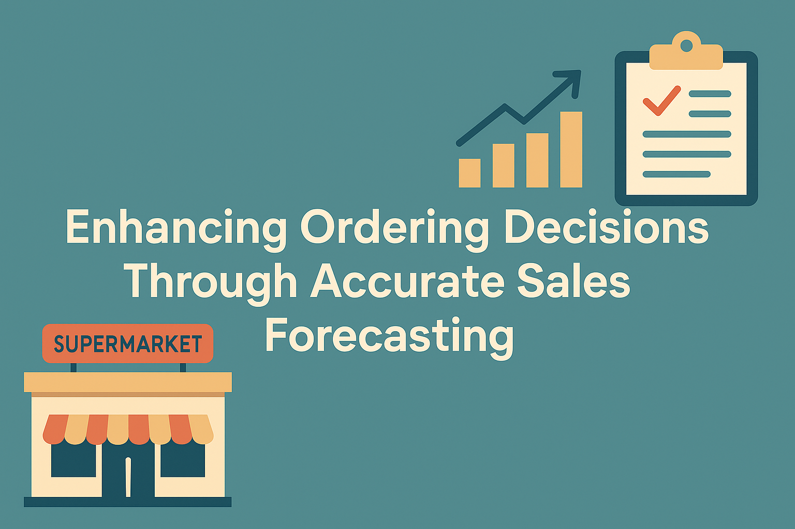
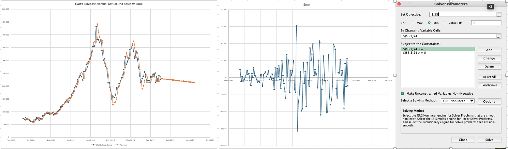
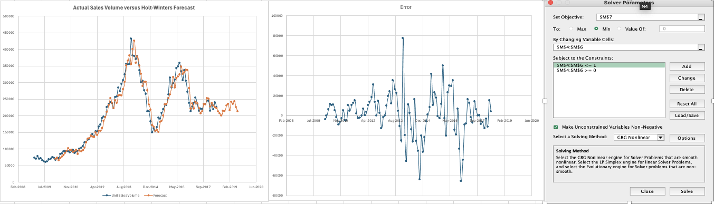
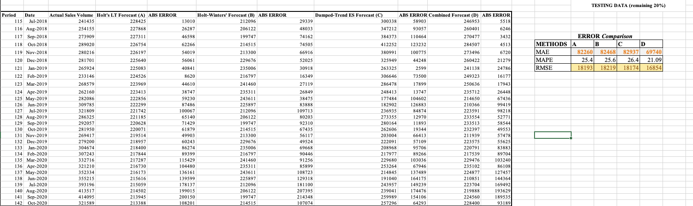

# 📈 Sales Forecasting for Inventory Optimization

---

---

## 📘 Overview

This project focuses on improving inventory management for an independent supermarket through accurate sales forecasting. Using Excel-based time series modeling, it compares multiple forecasting techniques—Holt’s Linear Trend, Holt-Winters Seasonal Model, and Damped-Trend Exponential Smoothing (SES with damping)—to determine the most effective method for minimizing stockouts and overstock.

---

## 🎯 Objectives

- Forecast monthly sales using time series methods
- Evaluate methods using error metrics (MAE, MAPE, RMSE)
- Recommend a forecasting strategy to optimize stock ordering
- Ensure replicability using only Excel and Solver

---

## 🧾 Dataset

- **Source:** Daily sales volume (Excel)
- **Time Range:** Jan 1, 2009 – Oct 24, 2020 (hypothetical)
- **Entries:** 4,315 observations
- **Aggregation:** Daily to monthly totals for clearer trend/seasonality

---

## 📊 Methods Applied

### 🔹 Holt’s Linear Trend (Method A)

- Captures trend without seasonality
- Uses Excel Solver to optimize level & trend parameters

**🖼️ Fig A: Solver Output – Holt’s Linear Trend**  

---

### 🔹 Holt-Winters Seasonal (Method B)

- Captures both trend and seasonality
- Optimizes alpha, beta, and gamma via Solver

**🖼️ Fig B: Solver Output – Holt-Winters Seasonal**  

---

### 🔹 Damped-Trend Exponential Smoothing (Method C)

- Adjusts for fluctuating trends using a damping factor
- Solver minimizes absolute error and RMSE

**🖼️ Fig C: Solver Output – Damped Trend ES**  

---

### 🔹 Combined Forecast (Method D)

- Averages Methods A, B, and C for improved accuracy
- Leverages the strengths of each individual model

**🖼️ Fig D: Combined Forecast Output**  

---

## 📈 Evaluation: Error Metrics

| Method | MAE     | MAPE    | RMSE      |
|--------|---------|---------|-----------|
| A      | 82,260  | 25.4%   | 18,192.65 |
| B      | 82,468  | 25.6%   | 18,219.33 |
| C      | 82,937  | 26.4%   | 18,174.48 |
| **D**  | **69,740** | **21.09%** | **16,854.37** |

**🖼️ Fig E: Forecast Accuracy Comparison**

---

## ✅ Findings & Recommendations

- The **Combined Forecast** (Method D) is the most accurate and reliable.
- Use Method D for monthly order decisions to minimize stockouts and overstock.
- Monitor forecast vs. actual sales monthly to recalibrate model if needed.
- Solver settings and parameters are fully documented in the workbook.

---

## 🔁 Replication & Audit

- Each method is clearly structured in Excel with labeled parameter cells
- Solver steps are reproducible
- “Cleaned Data” tab shows aggregated input with original trend patterns

---

## 🚀 Getting Started

1. Download the Excel workbook from this repository
2. Open `Enterprise Data.xlsx` <a href="https://github.com/ramanavbezborah/Sales-Forecasting-for-Inventory-Optimisation/blob/08e88620ff3ffea50c236dc916a9ff30e5f7549e/assets/Enterprise%20Data.xlsx" download>Get Dataset Here </a>
3. Navigate to each method’s worksheet
4. Use Solver to minimize RMSE and observe forecast outputs

---

## 📚 Reference

Makridakis, S., Spiliotis, E., & Assimakopoulos, V. (2020).  
_The M4 Competition: 100,000 time series and 61 forecasting methods._  
International Journal of Forecasting, 36(1), 54–74.  
https://doi.org/10.1016/j.ijforecast.2019.04.014

---

## 👤 Author

**Ramanav Bezborah**   
🔗 [GitHub Profile](https://github.com/ramanavbezborah)

